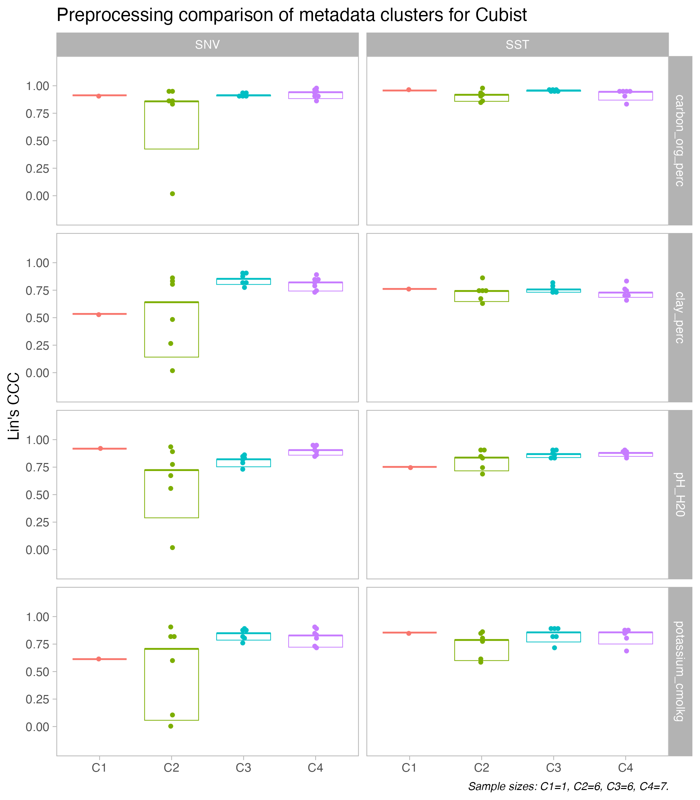

  
```{r setup, include=FALSE}
library("tidyverse")
library("qs")
mnt.dir <- "~/projects/mnt-ringtrial/"
```

## Overview

Inter-laboratory comparison of soil spectral measurements as part of the SoilSpec4GG project.

This repository is used for running statistical tests on the variations found for the ring trial instruments.

The development workspace is defined by:

- GitHub repository: [soilspectroscopy/ringtrial-stats](https://github.com/soilspectroscopy/ringtrial-stats).
- Google Cloud storage for efficient file storage and access: [whrc.org/soilcarbon-soilspec/storage/sc-ringtrial](https://console.cloud.google.com/storage/browser/sc-ringtrial).

## Experiment

The ring trial instruments' variability is assessed with the final performance metrics obtained from models trained with the KSSL soil spectral library. This operation is defined as calibration transfer.

For attenuating the variability across instruments, different preprocessing and model types were tested. These factors are statistically tested to make possible the identification of the best combination for attenuating the variability.

In addition, the instruments were grouped into four clusters and linked to their metadata information. Therefore, not only the modeling combinations are analyzed, but also the clusters and their associated metadata that may be driving the variations.

Compact letter display (cld) is provided for median after running pairwise permutation tests at the 5% level of significance. Top notch refers to median while bottom notch represents 10th percentile.

Example:


## Preprocessings


## Model types


## Metadata clusters


