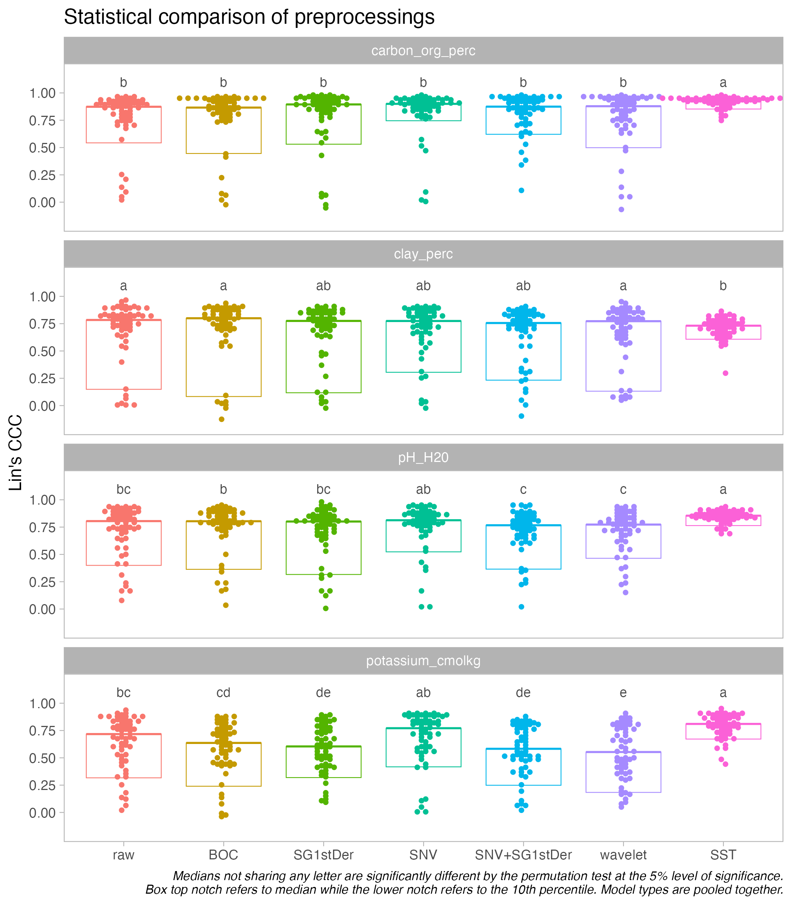
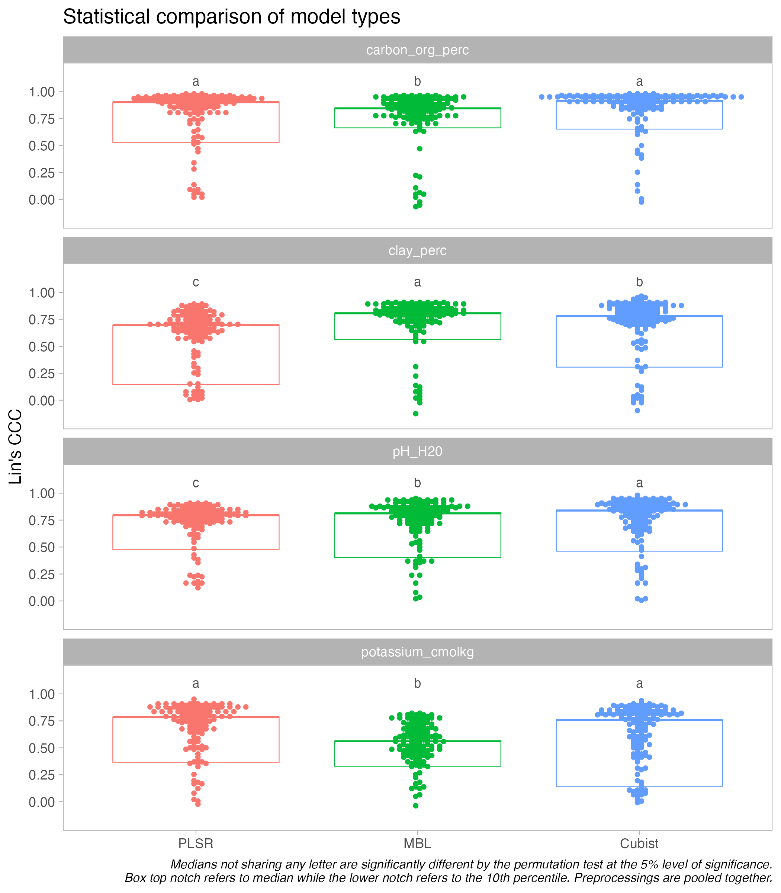
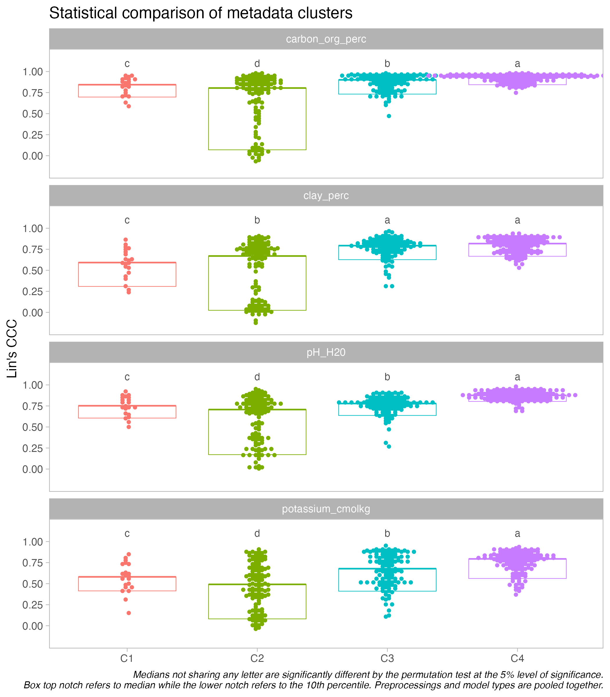
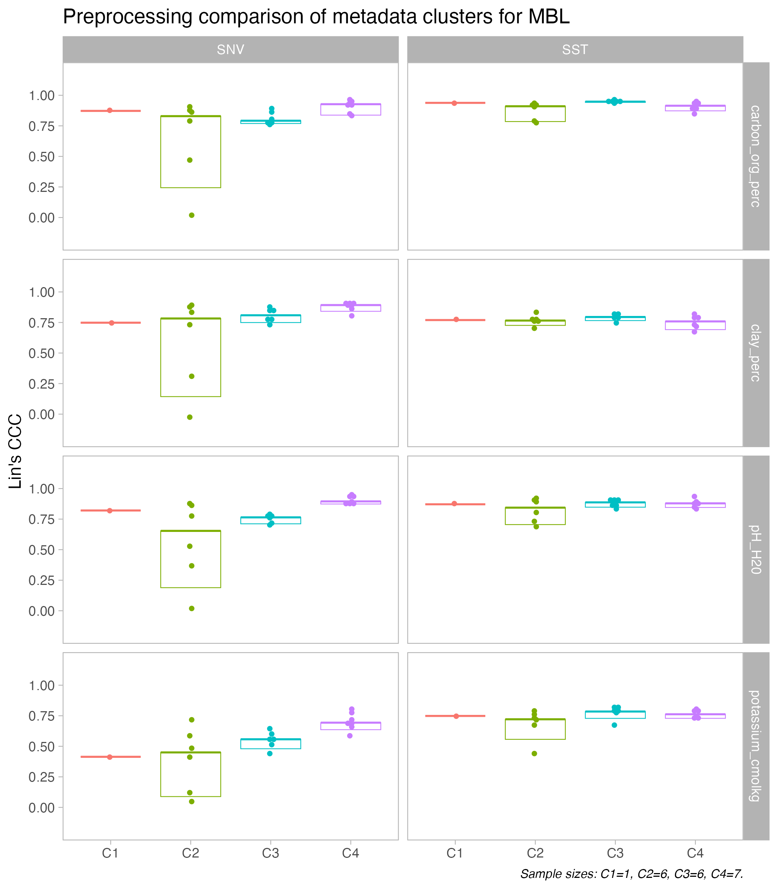
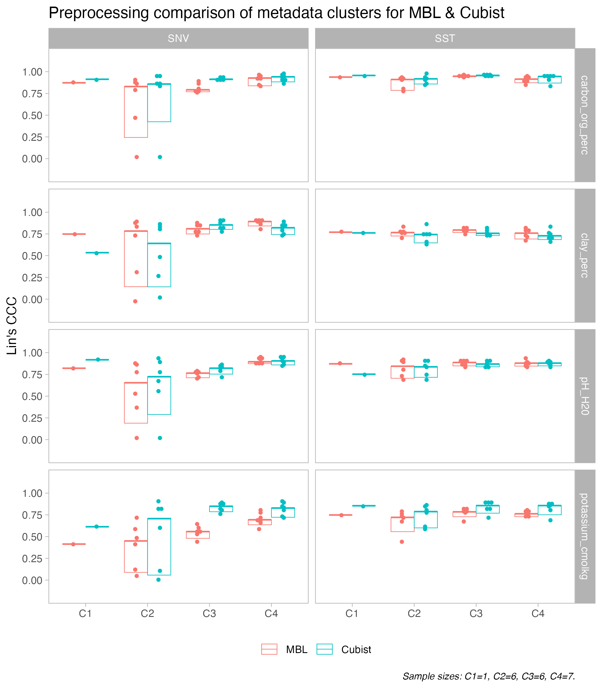
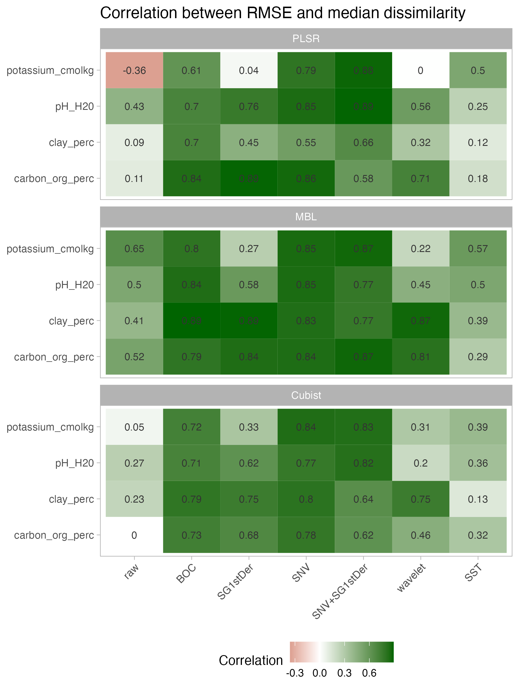
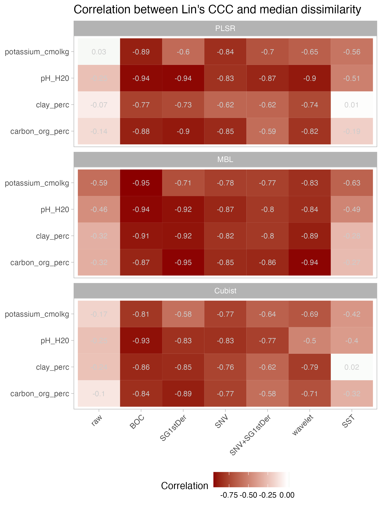
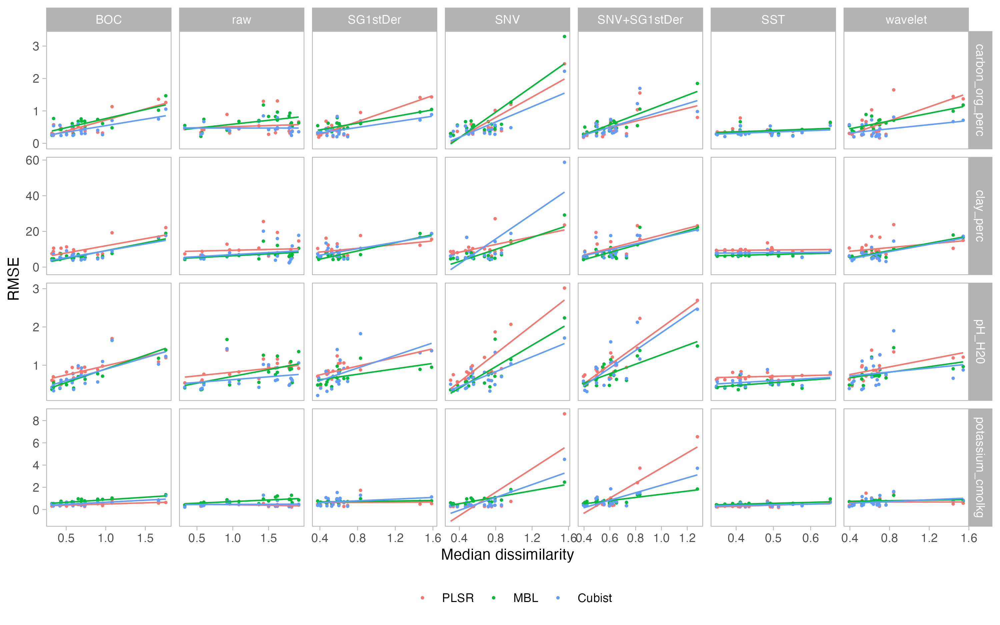
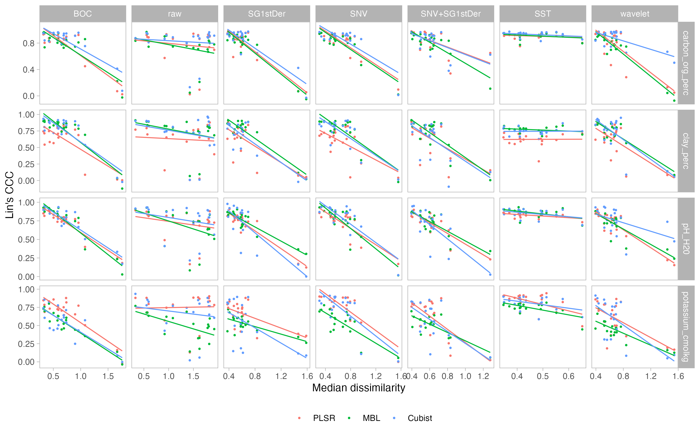

Soil spectroscopy ring trial
================

-   <a href="#overview" id="toc-overview">Overview</a>
-   <a href="#experiment" id="toc-experiment">Experiment</a>
-   <a href="#preprocessings" id="toc-preprocessings">Preprocessings</a>
-   <a href="#model-types" id="toc-model-types">Model types</a>
-   <a href="#metadata-clusters" id="toc-metadata-clusters">Metadata
    clusters</a>
-   <a href="#best-combination" id="toc-best-combination">Best
    combination</a>
-   <a href="#correlation-between-performance-and-dissimilarity"
    id="toc-correlation-between-performance-and-dissimilarity">Correlation
    between performance and dissimilarity</a>

## Overview

Inter-laboratory comparison of soil spectral measurements as part of the
SoilSpec4GG project.

This repository is used for running statistical tests on the variations
found for the ring trial instruments.

The development workspace is defined by:

-   GitHub repository:
    [soilspectroscopy/ringtrial-stats](https://github.com/soilspectroscopy/ringtrial-stats).
-   Google Cloud storage for efficient file storage and access:
    [whrc.org/soilcarbon-soilspec/storage/sc-ringtrial](https://console.cloud.google.com/storage/browser/sc-ringtrial).

## Experiment

The ring trial instruments’ variability is assessed with the final
performance metrics obtained from models trained with the KSSL soil
spectral library. This operation is defined as calibration transfer.

For attenuating the variability across instruments, different
preprocessing and model types were tested. These factors are
statistically tested to make possible the identification of the best
combination for attenuating the variability.

In addition, the instruments were grouped into four clusters and linked
to their metadata information. Therefore, not only the modeling
combinations are analyzed, but also the clusters and their associated
metadata that may be driving the variations.

Compact letter display (cld) is provided for median after running
pairwise permutation tests at the 5% level of significance. Top notch
refers to median while bottom notch represents 10th percentile.

Example: 

## Preprocessings

## Model types

## Metadata clusters

## Best combination

<!--  -->
<!--  -->

## Correlation between performance and dissimilarity

